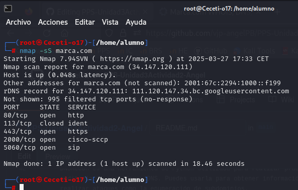

# PPS-Unidad3Actividad2-Angel

Unidad 3 - Actividad 2. Detección de equipos, puertos, servicios,vulnerabilidades.

Tenemos los siguientes objetivos:

> Aprender y conocer comandos y herramientas para escanear y localizar equipos y recursos.
> Practicar y probar en el entorno de pruebas con dichas herramientas.


---

## ACTIVIDADES A REALIZAR

* Buscar información sobre:

  - Cómo podemos obtener información pública utilizando el protocolo whois, web DomainTools y DNSRecon

   - Whois
     El protocolo whois permite obtener información sobre la propiedad y el registro de un dominio o una dirección         IP, para usarlo ejecutamos el comando whois seguido de un dominio o dirección IP.
  
     ```
     whois marca.com
     ```

     Al ejecutar el comando devolvería información como la fecha de registro, el registrador, los datos del                propietario y demás.

     

     


   - DomainTools
     DomainTools es un servicio web que permite buscar detalladamente sobre WHOIS, historial de dominios y otros           datos relacionados con un dominio o IP.

     Para usarlo, vamos a [https://whois.domaintools.com/](https://whois.domaintools.com/) y realizamo una búsqueda        con el nmbre del dominio o dirección IP que queramos investigar.
  
     


   - DNSRecon
     DNSRecon es una herramienta de Python utilizada para realizar pruebas de recopilación de información y                auditoría de servidores DNS. Puedes usarla para obtener información sobre registros DNS (A, MX, CNAME, NS) y          realizar ataques como la enumeración de subdominios.

     Para usar la herramienta ejecutamos el siguiente comando:
     
     ```
     python3 dnsrecon.py -d marca.com
     ```

     


  - Cómo podemos utilizar Nmap y nikto para buscar equipos, puertos abiertos, servicios y vulnerabilidades.

    - Nmap (Network Mapper)

      - Nmap es una herramienta muy popular para escanear redes y sistemas con el fin de encontrar puertos abiertos,          servicios en ejecución y posibles vulnerabilidades. 

        Para realizar un escaneo básico de puertos ejecutamos el comando:

        ```
        nmap -sS marca.com
        ```

        


    - Nikto

      Nikto es una herramienta de escaneo web que busca vulnerabilidades en aplicaciones web,
   
      Para utilizar la herramienta ejecutamos el comando: 

      ```
      nikto -h http://marca.com
      ```  

        


  - Cómo utilizar Wfuzz y Dirb para localizar recursos web en servidores.

    - Wfuzz

      - Wfuzz es una herramienta de fuzzing, se utiliza para descubrir recursos ocultos en un servidor web, puede             usarse para hacer fuzzing en URLs y otros parámetros.

        ```
        wfuzz -c -w /path/to/wordlist.txt http://marca.com/FUZZ
        ```

        


    - Dirb

      - Dirb es una herramienta para descubrir directorios en aplicaciones web.

        ```
        dirb http://marca.com /path/to/wordlist.txt
        ```

        


  - Qué scripts que podemos utilizar con Nmap para la búsqueda de vulnerabilidades.

    - Escanear vulnerabilidades web
 
      ```
      nmap --script http-sql-injection -p80 example.com
      ```
      
      
      
    - Escaneo de vulnerabilidades FTP
 
      ```
      nmap --script ftp-vsftpd-backdoor -p21 example.com
      ```
      
      


  - Cómo podemos buscar información sobre explotación de vulnerabilidades con searchsploit.

    Searchsploit es una herramienta que permite buscar exploits públicos basados en CVE y otros identificadores.

    El comando básico de searchsploit es

    ```
    searchsploit apache
    ```

     

    El comando buscará en la base de datos de Exploit-DB todos los exploits relacionados con apache.
 
    También podemos buscar un exploit específico por CVE:

    ```
    searchsploit CVE-2017-5638
    ```
    
    Ver detalles de un exploit:

    ```
    searchsploit -v exploit-name
    ```

     


  
* Instala en tu navegador la extensión de Shodan y muestra la información que tenemos tanto de ip, como de dominio del sitio: [http://iesvalledeljerteplasencia.es](http://iesvalledeljerteplasencia.es )

    


* Sobre la red del laboratorio PPS con kali, bWAPP, Multidillae y DVWA:

  - Ayudándote del fichero docker-compose localiza las diferentes máquinas y puertos que deberían de tener abiertos.

  DVWA tiene el puerto 8001, bwapp tiene el puerto 8002, la base de datos Multillidae el puerto 81, el servidor ldap de multillidae tiene el puerto 389, etc...

    


  - Identifica los equipos de la Red con Nmap.

    ```
    nmap -sP localhost
    ```

  - Realiza análisis de puertos, servicios y sistemas operativos de las MV.

    ```
    nmap -sV -p- localhost
    ```

    


  - Inspecciona los puertos con nikto.

    ```
    nikto -h http://localhost:8001
    ```
    
    
    

     ```
    nikto -h http://localhost:8002
    ```   

    
    

    ```
    nikto -h http://localhost:8080
    ```   

    
    

    ```
    nikto -h http://localhost:81
    ```   

    


    ```
    nikto -h http://localhost:82
    ```   

    


  - Busca las vulnerabilidades de las MV con los scripts de Nmap.

    ``` 
    sudo nmap --script=vuln 172.20.0.1
    ```
    
    


    ``` 
    sudo nmap --script=http-sql-injection,ssl-heartbleed -p 80,443 172.20.0.1
    ```
    
    


    ``` 
    sudo nmap --script=smb-vuln-ms17-010 -p 445 172.20.0.1
    ```
    
    


  - Localiza los servicios web que tienen las diferentes máquinas (Wfuzz y Dirb).

    Wfuzz

    ```
    wfuzz -c -z file,/usr/share/wordlists/dirb/common.txt http://127.0.0.1:8001/FUZZ
    ```

    


    ```
    wfuzz -c -z file,/usr/share/wordlists/dirb/common.txt http://127.0.0.1:8002/FUZZ
    wfuzz -c -z file,/usr/share/wordlists/dirb/common.txt http://127.0.0.1:8080/FUZZ
    wfuzz -c -z file,/usr/share/wordlists/dirb/common.txt http://127.0.0.1:443/FUZZ
    ```

    
 
    
    
 
    
    


    Dirb

     ```
     dirb http://127.0.0.1:8001/
     ```    

    


     ```
     dirb http://127.0.0.1:8002/
     ``` 

    


    ``` 
    dirb http://127.0.0.1:8080/
    dirb http://127.0.0.1:443/
    ``` 

    


  - Utiliza el comando searchsploit para buscar información de explotación de vulnerabilidades presentes en linux con     kernel 5


     ```
     searchsploit linux kernel 5
     ``` 

    


